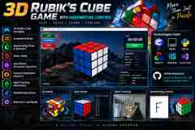
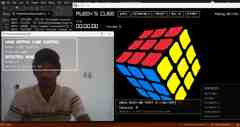

# Rubik's Cube Hand Control

A personal 3D Rubik's Cube project built in C and raylib, expanded step-by-step with speedcubing tools, automatic solving, OpenCV, MediaPipe and personal handwriting recognition.

## Project Preview






## Project Story

This project started as a simple idea: build a playable 3D Rubik's Cube. As I developed it, the idea changed several times and became a larger experiment combining 3D graphics, algorithms, speedcubing, computer vision and handwriting control.

### 1. 3D Rubik's Cube

The first stage was a virtual Rubik's Cube in C using raylib. I implemented individual cubies, sticker colors, face rotations, animated moves and keyboard controls.

### 2. Free 3D camera

I added 360-degree camera orbit, mouse and arrow-key camera control, face-relative movement and current facing-color detection.

### 3. Scramble and solved detection

The cube became a practice tool with random 20-move scrambles, animated scrambles, reset, solved-state detection and a solved animation/message.

### 4. Speedcubing timer and statistics

I added a START button, solve timer, automatic timer stop after solving, move count, best single, average of 5, average of 12 and total solves.

### 5. Undo and redo

- Ctrl+Z: Undo
- Ctrl+Y: Redo

### 6. Automatic solver

I integrated the Kociemba two-phase solver. The program reads the cube stickers, converts them to the solver representation, gets a solution, parses the moves, animates them and verifies the final solved state.

### 7. Camera and computer vision

I experimented with OpenCV webcam capture and MediaPipe hand landmarks. The camera can display hand landmark dots and lines, and the live feed is integrated into the raylib window.

### 8. Handwriting control

The interaction was changed from gesture-only control to writing Rubik's Cube move letters in the air using the index finger.

Supported moves:

R L U D F B

### 9. Personal handwriting recognition

The Python program tracks the index fingertip, collects the writing stroke, normalizes it and compares it with stored handwriting examples. Dynamic Time Warping (DTW) is used for comparison.

Communication pipeline:

```text
Webcam
  ↓
OpenCV
  ↓
MediaPipe
  ↓
Index-finger handwriting
  ↓
Personal handwriting recognition
  ↓
hand_command.txt
  ↓
C / raylib
  ↓
Rubik's Cube move
```

## Main Features

### Cube
- 3D Rubik's Cube
- Animated face rotations
- Face-relative controls
- Middle-layer moves
- 360-degree camera orbit
- Mouse and arrow-key camera control
- Scramble and reset
- Solved detection
- Undo and redo

### Speedcubing
- START button
- Solve timer
- Automatic timer stop
- Move count
- Best single
- Average of 5
- Average of 12
- Total solves

### Auto Solver
- Kociemba integration
- Cube-state conversion
- Solution parsing
- Animated solution
- Final solved-state verification

### Computer Vision
- OpenCV webcam capture
- MediaPipe hand tracking
- Live camera preview
- White landmark dots and lines
- Index-fingertip tracking

### Handwriting Control
- Personal handwriting training
- R / L / U / D / F / B
- Stroke collection
- Stroke normalization
- DTW recognition
- Python-to-C command communication

## Technologies

| Technology | Purpose |
|---|---|
| C | Main cube and game logic |
| raylib | 3D graphics, input and window |
| Python | Computer vision and handwriting |
| OpenCV | Webcam and image processing |
| MediaPipe | Hand landmark detection |
| Kociemba | Automatic solving |
| Visual Studio | Windows development |
| GitHub | Source control |

## Repository Structure

```text
Rubiks-Cube-Hand-Control/
├── src/
│   ├── main.c
│   ├── hand_writing_test.py
│   ├── resource_dir.h
│   └── application.rc
├── docs/
│   └── images/
│       ├── project-poster.jpg
│       ├── hand-control.jpg
│       └── cube-gameplay.jpg
├── README.md
├── requirements.txt
├── .gitignore
├── build-VisualStudio2026.bat
├── raylib-quickstart-main.slnx
├── raylib-quickstart-main.vcxproj
└── raylib-quickstart-main.vcxproj.filters
```

## Requirements

Install Python dependencies:

```bash
python -m pip install -r requirements.txt
```

Required Python packages:
- OpenCV
- MediaPipe 0.10.21
- Kociemba

The C side requires a working raylib + Visual Studio setup.

## Running

1. Install Python.
2. Install the packages from requirements.txt.
3. Build the Visual Studio/raylib project.
4. Start the handwriting/camera program:

```bash
python src/hand_writing_test.py
```

5. Start the raylib game.

The Python side creates the camera image and handwriting command files, and the C program reads them.

## Runtime Files

Generated files such as these are not source code:
- camera_frame.bmp
- hand_command.txt
- hand_gesture.txt

The personal handwriting training file my_handwriting_templates.json contains personal handwriting training data.

## Development Notes

The current Windows development version uses local paths for Python and project files. When another person clones the repository, those paths may need to be changed for their own computer.

## Why I Built This

I wanted one project where I could learn by continuously improving a working application.

The project helped me explore C programming, 3D graphics, game development, algorithms, Rubik's Cube logic, computer vision, hand tracking, pattern recognition and Python/C communication.

## Future Ideas

- Better handwriting recognition
- More robust configuration for other computers
- Cleaner camera integration
- More computer-vision controls
- Improved UI
- Easier installation and packaging
- More cube training features

## Contact

This is an ongoing personal project. If you have ideas, technical suggestions, collaboration opportunities, or can help improve the concept, please contact me.

**Email:** vishnivardhan1110@gmail.com

## Author

**Vishnu Vardhan**

C + raylib + Rubik's Cube + Computer Vision + Handwriting Control
